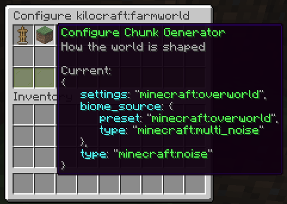

# WorldManager
Create and manage worlds in-game, through commands.

## Commands
The main command is `/worldmanager`. It has a shorter alias `/wm`.

- `/wm list` opens an overview gui of all custom worlds that have been created through this mod
- `/wm delete <id>` deletes the specified world, kicking all players that are currently in it
- `/wm tp <id> [<targets>]` teleports to the specified world to the players last location.
- `/wm seticon <id> [<icon>]` sets the world icon to the specified item, or the item in your hand.
- `/wm manage [<id>]` opens world management gui for the specified world, or the current world
- `/wm gamerule <rule> [<id>]` queries a gamerule for the specified world, or the current world
- `/wm gamerule <rule> <value> [<id>]` sets a gamerule for the specified world, or the current world

### Create
`/wm create <id>` opens a gui where you can configure your world (dimension type, chunk generator and seed)

`/wm create <id> <nbt>` allows you to create a world without using the gui (advanced). `{seed: 0L, generator: {biome: "minecraft:the_void", type: "fantasy:void"}, type: "minecraft:overworld"}` could be used to create a void world.

### Import
`/wm create <id> <path> [--custom-config]` allows you to import a world from a zip, rar or tar archive, or from a folder.

The file / folder needs to contain a valid `level.dat` file.
This will import the overworld dimension of the given world.

#### Multiverse
Multiverse doesn't correctly specify the world configuration. WorldManager won't be able to infer configurations like
world height or chunk generation. You should append `--custom-config` when importing to manually configure your world 
to match the original configuration as close as possible.

### Spawn
`/wm setspawn` sets the world spawn of the current world to your position.

`/wm spawn <id> [<targets>]` teleports to the specified world spawn. If the spawn point is not set, it uses the vanilla spawn point logic.

_Powered by [fantasy](https://github.com/nucleoidmc/fantasy) <3_